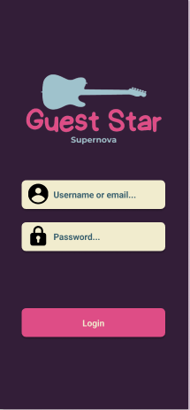

# [link do projeto em funcionamento ](https://deboramds.github.io/SAP008-social-network/src/index.html)

# Criando uma Rede Social

## Índice

* [1. Introdução ao Projeto ](#1.Introdução-ao-Projeto)
* [2. Sobre a Guest Star Supernova ](#2.Sobre-a-Guest-Star-Supernova)
* [3. Colaboradores do projeto ](#3-Colaboradores-do-projeto)
* [4. Tecnologias utilizadas ](#4-Tecnologias-utilizadas)
* [5. Configuração do projeto ](#5-Configuração-do-projeto)
* [6. Próximos passos e implementações futuras ](#6-Próximos-passos-e-implementações-futuras)
* [7. Licença ](#7-Licença)

***

## 1. Introdução ao Projeto

Projeto Proposto pelo Bootcamp da Laboratória Brasil. Nele nos foi desafiado construir uma Rede Social sobre um assunto que escolhessemos. Poderia ser, por exemplo, sobre alimentação saudável, feminismo, educação, saúde, energias renováveis, amantes das Empanadas, de Tacos, de Feijoada, ou do que seja.

A Rede Social teria que permitir à qualquer usuário criar uma conta de acesso, logar-se com ela, criar, editar, deletar e dar likes em publicações.

O objetivo principal de aprendizagem deste projeto foi construir uma Single-page Application (SPA) responsiva (com mais de uma tela/ página) na qual seja possível ler e escrever dados.

## 2. Sobre a Guest Star Supernova

Guest Star Supernova

Este é um projeto de uma rede social para amantes do rock chamada Guest Star Supernova, construída como uma aplicação de página única (SPA) utilizando JavaScript, HTML e CSS. A plataforma é um espaço virtual vibrante onde artistas, músicos e entusiastas do rock podem se reunir, compartilhar suas músicas, vídeos e informações, além de interagir com uma comunidade apaixonada pelo rock.

Nota importante: A Guest Star Supernova foi projetada primeiramente para dispositivos móveis, oferecendo uma experiência otimizada para smartphones e tablets. No entanto, também foi desenvolvida uma versão adaptada para telas de computador, garantindo a funcionalidade adequada em diferentes dispositivos.

Funcionalidades atuais

Autenticação:

Os usuários podem se cadastrar usando um email e senha, que são armazenados no banco de dados.

Os usuários também podem fazer login usando uma conta do Google.

O sistema de autenticação é implementado usando Firebase Authentication.

Feed de postagens:

- Os usuários podem criar postagens, que serão exibidas em um feed principal.

- Cada postagem exibe o nome do autor, a data de criação e o conteúdo da postagem.

- Os usuários podem curtir as postagens de outros usuários.

- Os usuários podem editar suas próprias postagens existentes.

- Os usuários podem excluir suas próprias postagens.

Divulgação de músicas:

- Os usuários podem carregar suas faixas, vídeos e álbuns para compartilhar com a comunidade.

- É possível compartilhar composições originais, covers e registros ao vivo de performances.

- Conexão entre artistas:

- Os usuários podem estabelecer conexões com outros músicos e bandas de rock.

- É possível colaborar em projetos musicais conjuntos e compartilhar dicas e truques com outros artistas.

Recursos educacionais:

- A plataforma oferece um acervo de informações sobre o rock, incluindo histórias, entrevistas e notícias.

- Recursos educacionais estão disponíveis para ajudar os usuários a aprimorar suas habilidades musicais.

Engajamento com a comunidade:

- Os usuários podem participar de fóruns de discussão, debates e análises sobre o rock.

- É possível comentar e compartilhar publicações de outros membros, descobrir novas bandas e artistas promissores.

Protótipo de alta fidelidade

Foi desenvolvido um protótipo de alta fidelidade para a interface da Guest Star Supernova usando a ferramenta Figma.

A paleta de cores foi pensada afim de criar uma identidade visual:

## 3. Colaboradores do projeto
Este projeto foi desenvolvido por uma equipe de colaboradores apaixonados por rock e tecnologia:

- Colaboradora 1 - Débora Martins

- Colaboradora 2 - Luciana Chamma

Agradecemos a todos os colaboradores que contribuíram para o desenvolvimento deste projeto.

## 4. Tecnologias utilizadas

- JavaScript: Linguagem de programação utilizada para a lógica e interatividade da aplicação.

- HTML: Linguagem de marcação utilizada para estruturar a interface da aplicação.

- CSS: Linguagem de estilo utilizada para a aparência e o layout da aplicação.

- Firebase: Plataforma de desenvolvimento de aplicativos móveis e web que fornece serviços de autenticação, armazenamento de dados e hospedagem.

- Git: Sistema de controle de versão distribuído utilizado para gerenciar o código-fonte do projeto.

- GitHub: Plataforma de hospedagem de código-fonte e colaboração que permite o compartilhamento e a contribuição para projetos.

- Figma: Ferramenta de design de interfaces utilizada para criar o protótipo de alta fidelidade da aplicação.

- Node.js: Ambiente de execução JavaScript utilizado para rodar o servidor da aplicação.

## 5. Configuração do projeto

1. Para configurar corretamente o projeto, siga as instruções abaixo:

2. Clone este repositório para o seu ambiente local.

3. Abra o terminal e navegue até o diretório raiz do projeto.

4. Execute o seguinte comando para instalar as dependências necessárias:

5. Copy code

6. npm install

 Crie um arquivo .env na raiz do projeto e defina as seguintes variáveis de ambiente:

1. makefile

2. Copy code

3. PORT=3000

4.  DB_URL=your_database_url

5. GOOGLE_CLIENT_ID=your_google_client_id

6. GOOGLE_CLIENT_SECRET=your_google_client_secret

7. PORT: A porta em que o servidor será executado localmente (padrão: 3000).

8. DB_URL: A URL de conexão do seu banco de dados.

9. GOOGLE_CLIENT_ID e GOOGLE_CLIENT_SECRET: As credenciais da API do Google para autenticação.

Execute o seguinte comando para iniciar o servidor:

1. sql

2. Copy code

3. npm start

4. O servidor será iniciado e estará disponível em http://localhost:3000 (ou a porta definida no arquivo .env).

## 6. Próximos passos e implementações futuras

- Inserção de imagens: Implementar a capacidade de os usuários inserirem imagens em suas postagens.

- Inserção de vídeos: Implementar a capacidade de os usuários inserirem vídeos em suas postagens.

- Notificações: Adicionar notificações para os usuários sobre atividades relevantes, como curtidas em suas postagens ou comentários.

- Comentários: Permitir que os usuários comentem nas postagens de outros usuários.

- Perfis de usuário: Implementar perfis de usuário onde os usuários possam adicionar informações pessoais e exibir suas postagens e atividades.

- Configurações de privacidade: Adicionar opções de privacidade para que os usuários possam controlar quem pode ver suas postagens.

- Melhorias de UI/UX: Aprimorar a aparência e a experiência do usuário com um design responsivo e intuitivo.

- Pesquisa de postagens: Adicionar uma funcionalidade de pesquisa para que os usuários possam encontrar postagens com base em palavras-chave ou hashtags.

- Contribuindo

Contribuições são bem-vindas! Se você quiser contribuir para este projeto, fique à vontade para abrir uma issue ou enviar um pull request.

## 7. Licença

Este projeto está licenciado sob a MIT License. Você é livre para modificar e distribuir o código-fonte de acordo com os termos da licença.

## 8. Contato

Se você tiver alguma dúvida, sugestão ou feedback sobre este projeto, sinta-se à vontade para entrar em contato conosco:

Equipe Guest Star Supernova

Email: deborah.mart@hotmail.com

Agradecemos por usar a Guest Star Supernova e esperamos que você desfrute da experiência em nossa rede social voltada 
para amantes do rock. Juntos, vamos reacender a chama do rock e celebrar essa forma de expressão poderosa!

Let's rock! :metal:

